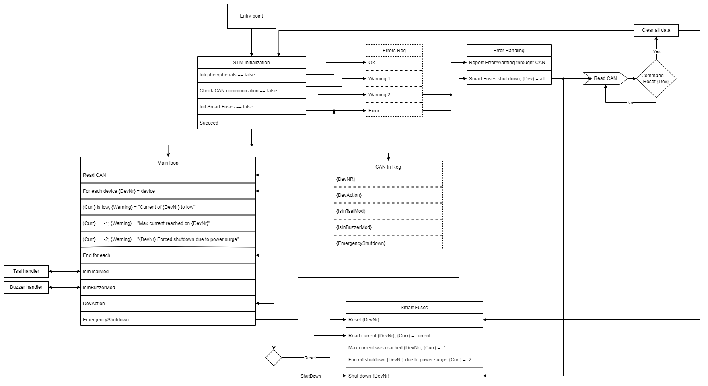

# PUTM_EV_SMART_FUSES_2022

## Motivaion
The main principle behind the concept of Smart Fuses was adaptability and ease of resetting fuses, what with the past designs was hard to accomplish.

## Our solution 
The creation of a specially designed board responsible of directing and managing the current flow.

## Description
The Smart Fuses board is responsible for two primary things:
- control over chips with integrated fuses based on mosfets,
- control over tsal (tractive system active light) and buzzer.

## Basic flow chart

